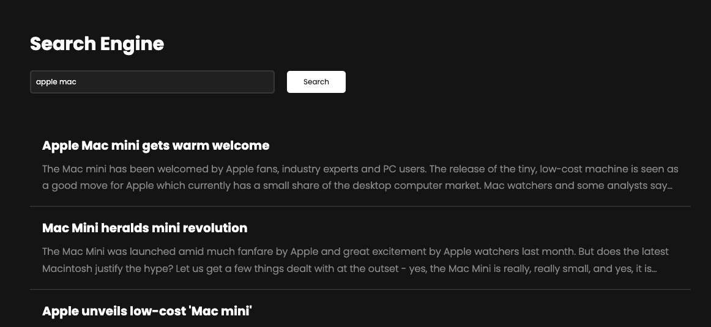
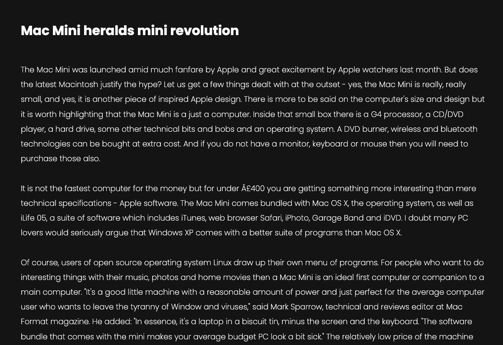

# Document Search Engine

Live demo at [this link](https://search-engine-web.vercel.app/).

## About
This project introduces a text-based document search engine. The user inputs a search query and the engine searches for documents that are most relevant to the search query based on their contents.

## Dataset
The dataset is taken from [Kaggle](https://www.kaggle.com/datasets/sunilthite/text-document-classification-dataset/data). It is a `.csv` file that contains 2225 documents classified into five categories - politics, sport, technology, entertainment and business. These documents contain news articles about the mentioned topics in the format of UTF-8 plain text in the English language.

## Technical details

### Preprocessing
The relevancy ranking mechanism of the search engine is a vector model based on the bag-of-features model. In the document preprocessing phase, the documents are scanned and vectorized. This process contains of several stages:
1. processing of terms
2. generation of term frequency maps
3. generation of dictionary
4. generation of term-document frequency map
5. generation of the inverted index map
6. generation of document vectors

#### 1. Term processing
In this stage, the text content of each document is split into terms (words) and the indiviual terms are processed and transformed. This step involves:
1. removing numbers
2. casting the terms to lower case
3. removing unnecessary terms (a, an, the, this, that, etc.)
4. removing terms of length 1
5. stemming the terms

The most important step is term stemming, which transforms the term into its stem form. For instance, the term "unconditionally" becomes "condition". This step helps minimizing the volume of the dictionary, putting terms with the same stem into the same class.

#### 2. Term frequencies
Each document stores a frequency map. It represents the number of occurences of each term in the document. The more occurences a term has in the document, the more significant the term is. These frequencies will be helpful in later steps.

```ts
function processDocument(text: string): ProcessedDocument {
    const id: DocumentID = uuid4();
    const terms: Term[] = this.processTerms(text);
    const freqs: TermFreqMap = {};

    for (const term of terms) {
        const freq: number = freqs[term] === undefined ? 1 : freqs[term] + 1;
        freqs[term] = freq;
    }

    return { id, text, terms, freqs, vector: [] };
}
```

#### 3. Dictionary
After all the documents and their terms have been processed, the search engine generates the dictionary. Dictionary is a vector of all terms present in all documents, that's dimension determines the dimension of the vector space in which we are going to operate. In order to generate the dictionary, we traverse all terms of all documents and add them to a set of terms. Finally, we transform the set into a vector (array) and sort it in lexicographic order.

```ts
const termSet: Set<Term> = new Set();

const processedDocuments: ProcessedDocument[] = documents.map((document: DatasetDocument) => {
    const processedDocument: ProcessedDocument = this.documentProcessor.processDocument(document.text);
    processedDocument.terms.forEach((term: Term) => termsSet.add(term));
    return processedDocument;
});

this.dictionary = Array.from(termSet);
```

#### 4. Term-Document frequencies
This is a helper step in which we create a hash map with keys representing terms and values representing the number of documents in which the term has occured at least once. This hash map will be helpful to us in generating the document vectors and weighing the vector elements.

```ts
function buildTermDocumentFreqs(dictionary: Dictionary, documents: ProcessedDocument[]): void {
    this.termDocumentFreqMap = {};

    dictionary.forEach((term: Term) => {
        this.termDocumentFreqMap[term] = 0;

        documents.forEach((document: ProcessedDocument) => {
            if (document.freqs[term] !== undefined) {
                this.termDocumentFreqMap[term] = this.termDocumentFreqMap[term] + 1;
            }
        });
    });
}
```

#### 5. Inverted index
In the last step, we generate an inverted index map - a data structure that will improve the performance of searching. The data structure of the inverted index is a hash map that contains keys for each term from the dictionary. Each key's value is an array of document IDs which are relevant for that term - documents that contain the given term. In this way, upon inputing a search query, we can retrieve documents that contain terms present in the search query and rank these documents only, omitting the vast majority of documents not relevant to our search query.

```ts
function buildInvertedIndex(dictionary: Dictionary, documents: ProcessedDocument[]): void {
    this.invertedIndexMap = {};

    dictionary.forEach((term: Term) => {
        const relevantDocumentIds: DocumentID[] = [];

        documents.forEach((document: ProcessedDocument) => {
            if (document.freqs[term] !== undefined) {
                relevantDocumentIds.push(document.id);
            }
        });

        this.invertedIndexMap[term] = relevantDocumentIds;
    });
}
```

#### 6. Vectorizing documents
This is the most important step in the preprocessing stage. For each document, we generate a vector, where the vectors of all documents are of the same dimension (the dimension of the dictionary). This is crucial for searching, since we are going to be calculating distances between vectors.

First, we iterate through all documents. For each document, we iterate over all terms in the shared dictionary. If the current term is not present in the document, we put `0` to the document vector. Otherwise we calculate the weighted value of the term. To calculate the weighted value, we follow these steps:
1. `tf = number of occurences of the term in the document / number of all terms in the document`
2. `df = number of documents containing the term`
3. `idf = log(total number of documents / (1 + df))`
4. `tfidf = tf * idf`

In this way, we generate a vector for each documents, where each element of the vector corresponds to one term in the shared dictionary and its value is determined by the factors above. The more occurences of the term the document contains, the more important the term for the document is. However, the more documents contain the term, the less relevant the term becomes. After vectorizing the documents, we have transformed the textual representation of the documents to a mathematical representation in form of vectors.

```ts
processedDocuments.forEach((document: ProcessedDocument) => {
    this.dictionary.forEach((term: Term) => {
        const tf = (document.freqs[term] ?? 0) / document.terms.length;
        const df = this.documentIndexer.getIndexedTerm(term);
        const idf = Math.log2(processedDocuments.length / (1 + df));
        const tfidf = tf * idf;

        document.vector.push(tfidf);
    });
});
```

### Searching
After the preprocessing phase, the search engine is ready to process the search query and return relevant documents. When the user enter a search query and initiates the search, the following happens:
1. generation of the query document
2. retrieval of relevant documents
4. ranking the documents

#### 1. Query document
After the user has entered a search query and initiated the search, a document is created from the input query string. This document is processed in the same way as the documents from the dataset and is finally vectorized to the shared vector space.

#### 2. Relevant documents
Then, we use the inverted index map to retrieve documents that are relevant to our search query. More specifically, for each term of the search query, we retrieve documents containing this term.

```ts
const relevantDocumentIds: Set<DocumentID> = new Set();

queryDocument.terms.forEach((term: Term) => {
    this.documentIndexer.getInvertedIndex(term).forEach((id: DocumentID) => {
        relevantDocumentIds.add(id);
    })
});
```

#### 3. Ranking
In this step, we calculate the distance of the query document to each relevant document found in the previous step. For this, we use the cosine similarity functions. After the distances have been calculated, we sort the relevant documents by their distances to the query document. The smaller the distance is, the more relevant the document is. Finally, we return the first `n` documents to the user. These documents are the most relevant documents to the user's input search query.

```ts
const distances: DocumentDistance[] = relevantDocuments.map((document: ProcessedDocument) => ({
    id: document.id,
    distance: DocumentMath.cosineSimilarity(queryDocument.vector, document.vector),
}));

const results: DocumentDistance[] = distances
    .filter(value => value.distance !== 0)
    .sort((a, b) => b.distance - a.distance)
    .slice(0, count);
```

```ts
export function cosineSimilarity(vector1: Vector<number>, vector2: Vector<number>): number {
    return dotProduct(vector1, vector2) / (magnitude(vector1) * magnitude(vector2));
}
```

## Web interface
The web interface serves as a medium for the user to search in the dataset of documents.

Upon first load of the web application, while the documents are being processed, a `loading` overlay is shown to the user. As soon as the documents are processed, the overlay is hidden and the user can use the search engine.


The user can enter a search query to the search input field and click on the "Search" button.


Upon clicking on the "Search" button, the relevant documents are shown to the user.



After clicking on any of the displayed documents, the user is redirected to the document detail page where the full article is displayed.



by [Tomas Boda](https://github.com/TomasBoda)